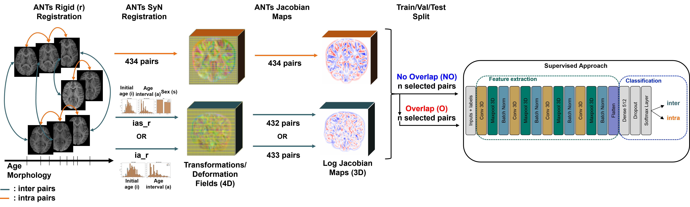
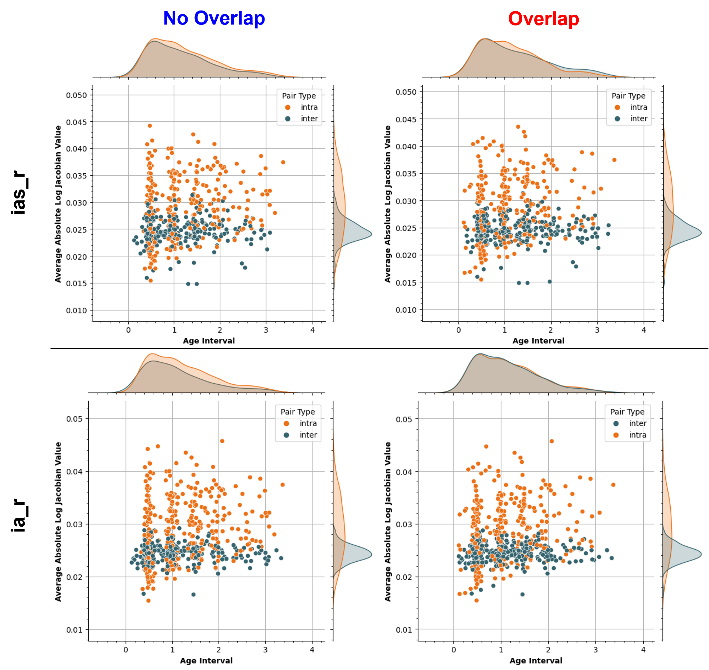

# Can We Encode Intra- and Inter-Variability with Log Jacobian Maps Derived from Brain Morphological Deformations Using Pediatric MRI Scans?

# Whole Pipeline
||
|:--:| 
|The pipeline involves rigid registration of intra and inter pairs from 96 subjects, followed by ANTs SyN registration for elastic deformation extraction. The deformation is transformed into Jacobian maps and log-scaled. Using 10-fold cross-validation, 10 sets with no overlaps were generated, resulting in 598 and 538 pairs for the ia\_r and ias\_r experiments respectively. In the overlap scenario, the same number of pairs were randomly selected whilst also ensuring a balanced 50/50 split between intra and inter pairs. These pairs are then fed into a 17-layer CNN. It is trained and tested with either overlap or no overlap in a 10-fold cross-validation scheme|
# Log Jacobian Analysis
||
|:--:| 
|Non-distinct distributions of the average absolute log Jacobian value amongst the selected pairs for both no overlap (left) and overlap (right) scenarios with regards to the age interval per pair colored by their pair type (or label). The ias_r experiment results are shown on top and ia_r on the bottom|
